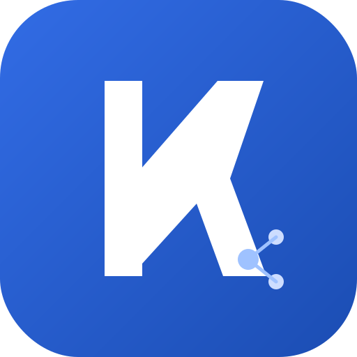

<div align="center">



# KCNA Prep

**A free, offline-capable study app for the Kubernetes & Cloud Native Associate (KCNA) exam.**
Study notes · spaced-repetition flashcards · weighted mock exams · honest readiness model · knowledge base · 11-week plan.

[](https://github.com/seanyfresh/kcna-prep/actions/workflows/ci.yml)
[](https://github.com/seanyfresh/kcna-prep/actions/workflows/codeql.yml)
[](https://github.com/seanyfresh/kcna-prep/actions/workflows/pages.yml)
[](LICENSE)


</div>

---

## What's inside

- **📚 Learn** — 35 concise, exam-focused notes across all KCNA domains, each with
  links to **authoritative documentation** for further reading.
- **🃏 Flashcards** — 139 spaced-repetition cards (SM-2 lite; hard cards return sooner)
  in three modes: multiple-choice, type-the-answer (fuzzy-graded), or flip-to-review.
- **📝 Practice** — **253 fact-checked questions**: quiz by domain, run a 25-question
  diagnostic, or sit a full **60-question / 90-minute mock** weighted exactly like the real exam.
- **🎯 Readiness** — an honest readiness score, predicted exam score, pass likelihood,
  per-domain mastery, and recommended next actions. Updates as you practice.
- **🗓️ Plan** — an 11-week study plan with a live countdown and check-off tasks.
- **📖 Reference** — a searchable **glossary** (58 terms), **official documentation**
  links per domain, and verified **exam facts**.

### New in 1.0

🔎 Global search (`⌘/Ctrl + K`) · ⚙️ Settings (configurable exam date, **light/dark theme**) ·
💾 Progress **export/import** to move between devices · 🔥 study **streak** ·
⌨️ keyboard shortcuts · 📲 **installable PWA that works offline** · ♿ accessibility
(skip link, ARIA live regions, focus management, reduced-motion).

## Exam blueprint (current, 2026)

> ⚠️ **The KCNA exam was updated (effective ~Nov 24, 2025).** It now has **four**
> domains, not five — **Observability is examined within Cloud Native Architecture**.
> This app uses the current weights, so your mock exams match the real test. Verified
> against [training.linuxfoundation.org](https://training.linuxfoundation.org/certification/kubernetes-cloud-native-associate/)
> and [cncf.io](https://www.cncf.io/training/certification/kcna/).

| Domain | Weight |
|---|---|
| Kubernetes Fundamentals | 44% |
| Container Orchestration | 28% |
| Cloud Native Application Delivery | 16% |
| Cloud Native Architecture *(includes Observability)* | 12% |

**Exam facts:** 60 multiple-choice questions · 90 minutes · pass mark **75%** ·
online/remotely proctored · **$250** USD (one free retake) · certification valid **2 years**.
*(Always confirm the latest details on the official exam page before booking.)*

## Run it

**Easiest:** double-click **`Open KCNA Prep.command`** (macOS),
**`Open KCNA Prep (Windows).bat`** (Windows), or run **`./open-kcna-prep.sh`** (Linux).

**From a terminal:**

```bash
python3 serve.py        # → http://localhost:4178  (with security headers)
# or
make serve
# or the simplest possible:
python3 -m http.server 4178
```

**With Docker:**

```bash
docker compose up -d    # → http://localhost:4178
```

See **[docs/DEPLOYMENT.md](docs/DEPLOYMENT.md)** for GitHub Pages, Netlify, Vercel,
and any-static-host instructions.

Your progress (quiz history, flashcard schedule, plan, settings) is saved in your
browser's local storage on this device. Back it up or move it via **Settings →
Export / Import**.

## Tech & design

Vanilla **HTML/CSS/JS**. **No framework, no build step, no runtime dependencies** —
fork it, read it, host it anywhere. Architecture details:
**[docs/ARCHITECTURE.md](docs/ARCHITECTURE.md)**.

```
index.html               app shell + script load order
assets/
  css/styles.css         styling (dark + light themes)
  js/                     theme-boot, data-registry, storage, settings, study-plan,
                          readiness, flashcards, exams, search, app, pwa
  icons/                  PWA icons (SVG + PNG)
data/                     generated content, one file per domain + references + glossary
service-worker.js         offline caching
manifest.webmanifest      PWA manifest
docs/                     deployment, architecture, security audit
```

## Security

A fully client-side app with a small, well-defended attack surface: strict
Content-Security-Policy, escaped rendering, validated imports, hardened response
headers on every deploy target, and automated CodeQL scanning. Full write-up:
**[docs/SECURITY-AUDIT.md](docs/SECURITY-AUDIT.md)**. Report issues privately via
**[SECURITY.md](SECURITY.md)**.

## Contributing

Corrections to study content are especially welcome — every fact should be
checkable against an authoritative source. See **[CONTRIBUTING.md](CONTRIBUTING.md)**
and the **[CHANGELOG](CHANGELOG.md)**.

## Scheduling the real exam

This app does **not** register you for the official exam. Book the KCNA at the
[Linux Foundation](https://training.linuxfoundation.org/certification/kubernetes-cloud-native-associate-kcna/)
with your own account when you're ready.

## License & disclaimer

[MIT](LICENSE). Independent community study aid — **not** affiliated with or endorsed
by the CNCF or The Linux Foundation. "KCNA", "Kubernetes", and "CNCF" are trademarks
of The Linux Foundation.
